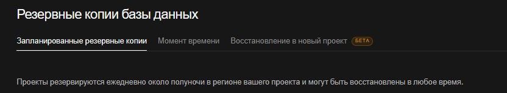

# Инструкция по развёртыванию

## Веб‑панель управления Telegram‑ботом записи на стирку

---

## 1. Требования к серверу

### Минимальные требования

| Компонент                 | Версия / Характеристика                                  |
| ---------------------------------- | ---------------------------------------------------------------------------- |
| **Веб‑сервер**     | Apache 2.4+                                                                  |
| **PHP**                      | 8.0                                                                          |
| **Расширения PHP** | `pdo_pgsql`, `zip`, `json`, `session`, , `PHPword`, `mbstring` |
| **СУБД**                 | PostgreSQL 12+                                                               |
| **Composer**                 | 2.x                                                                          |
| **ОС**                     | Linux (Ubuntu 20.04/22.04), Windows Server                                   |
| **Доп. ПО**             | Git (для клонирования)                                        |

### Рекомендуемые ресурсы

* **ОЗУ** : 512 МБ (минимум), 1 ГБ+ (с учётом PostgreSQL)
* **Диск** : 500 МБ под код + база данных
* **Процессор** : 1 vCPU

---

## 2. Пошаговая настройка

### 2.1. Клонирование репозитория

**bash**

```
git clone https://github.com/Ratarion/stirka_site.git
cd stirka_site
```

### 2.2. Настройка веб‑сервера

#### Пример .htaccess (если используется переадресация)

Файл `.htaccess` в корне или `public/`:

**apache**

```
DirectoryIndex index.php
RewriteEngine On
RewriteBase /

RewriteCond %{REQUEST_FILENAME} !-f
RewriteCond %{REQUEST_FILENAME} !-d
RewriteRule ^ index.php [QSA,L]
```

### 2.3. Настройка подключения к БД

Создайте файл `config/db_connect.php` со следующим содержимым:

**php**

```
<?php
$host = 'localhost';
$dbname = 'stirka_db';
$user = 'stirka_user';
$pass = 'strong_password';

try {
    $pdo = new PDO("pgsql:host=$host;dbname=$dbname", $user, $pass);
    $pdo->setAttribute(PDO::ATTR_ERRMODE, PDO::ERRMODE_EXCEPTION);
} catch (PDOException $e) {
    die("DB connection failed: " . $e->getMessage());
}
```

### 2.4. Установка зависимостей Composer

Убедитесь, что Composer установлен глобально:

**bash**

```
curl -sS https://getcomposer.org/installer | php
sudo mv composer.phar /usr/local/bin/composer
```

Затем в корне проекта:

**bash**

```
composer install
```

Эта команда установит:

* `phpoffice/phpspreadsheet` – для Excel
* `phpoffice/phpword` – для Word
* `monolog/monolog` – для логирования (если используется)

> [СКРИНШОТ: успешное выполнение `composer install` с выводом зависимостей]

### 2.5. Настройка логгера (опционально)

Файл `config/logger.php`:

**php**

```
<?php
// config/logger.php — ЛОГГЕР (Monolog)

$root = dirname(__DIR__);  // корень проекта

require_once $root . '/vendor/autoload.php';

use Monolog\Logger;
use Monolog\Handler\RotatingFileHandler;
use Monolog\Handler\StreamHandler;
use Monolog\Formatter\LineFormatter;

// Создаём логгер
$log = new Logger('stirka_site');

// Основной лог (с ротацией)
$fileHandler = new RotatingFileHandler($root . '/logs/app.log', 30, Logger::DEBUG);
$formatter = new LineFormatter(
    "[%datetime%] %level_name% : %message% %context% %extra%\n",
    "Y-m-d H:i:s"
);
$fileHandler->setFormatter($formatter);
$log->pushHandler($fileHandler);

// Отдельный файл только для ошибок
$errorHandler = new StreamHandler($root . '/logs/error.log', Logger::ERROR);
$log->pushHandler($errorHandler);
```

### 2.6. Создание администратора (первый вход)

Так как самостоятельной регистрации нет, добавьте учётную запись администратора через SQL:

**sql**

```
INSERT INTO administrators (username, password_hash, role)
VALUES ('admin', '$2y$10$...', 1);
```

Хеш пароля можно сгенерировать с помощью простого PHP‑скрипта:

**bash**

```
php -r "echo password_hash('ваш_пароль', PASSWORD_DEFAULT);"
```

### 2.7. Проверка работы

Откройте браузер по адресу `http://stirka.local/booking`.

* Если открывается страница бронирований – веб‑сервер настроен верно.
* Нажмите  **«Вход в админ-панель»** , введите логин `admin` и пароль, который вы задали.

---

## 3. Резервное копирование

### 3.1. Резервное копирование базы данных



---

## 4. Часто встречающиеся проблемы при развёртывании

| Проблема                                                   | Решение                                                                                                                     |
| ------------------------------------------------------------------ | ---------------------------------------------------------------------------------------------------------------------------------- |
| `DB connection failed: could not find driver`                    | Установить `php-pgsql` / `php8.2-pgsql` и перезапустить Apache                                         |
| Ошибка 403 Forbidden при доступе к `public/`    | Проверить `Options Indexes` и права на директорию (755)                                               |
| Пустая страница при открытии `/booking` | Включить `display_errors` в `php.ini`, посмотреть логи (`logs/app.log`, error_log)                    |
| `Class 'ZipArchive' not found`                                   | Установить `php-zip` и перезапустить веб‑сервер                                                |
| Ошибка при подключении к PostgreSQL           | Проверить `pg_hba.conf` – разрешить подключение с localhost (метод `md5` или `trust`) |
| Composer не может записать в `vendor/`           | Выдать права:`chmod 775 vendor` или `composer install --no-scripts`                                              |

---

## 5. Развёртывание с помощью Docker (альтернативный способ)

Если вы предпочитаете Docker, используйте следующий `docker-compose.yml` (создайте в корне проекта):

**yaml**

```
version: '3.8'

services:
  web:
    build: .
    container_name: php-apache-app
    ports:
      - "8080:80" 
    volumes:
      - .:/var/www/html
    environment:
      - APACHE_RUN_USER=www-data
      - APACHE_RUN_GROUP=www-data
```

И `Dockerfile` в корне:

**dockerfile**

```
FROM php:8.0-apache

# Устанавливаем системные зависимости, нужные для PostgreSQL
RUN apt-get update && apt-get install -y \
    libpng-dev \
    libonig-dev \
    libxml2-dev \
    libpq-dev \
    zip \
    unzip \
    git \
    curl

# Устанавливаем расширения PHP (добавили pdo_pgsql и pgsql)
RUN docker-php-ext-install pdo_mysql pdo_pgsql pgsql mbstring exif pcntl bcmath gd

# Включаем mod_rewrite
RUN a2enmod rewrite

# Настройка DocumentRoot
ENV APACHE_DOCUMENT_ROOT /var/www/html/public
RUN sed -ri -e 's!/var/www/html!${APACHE_DOCUMENT_ROOT}!g' /etc/apache2/sites-available/*.conf
RUN sed -ri -e 's!/var/www/!${APACHE_DOCUMENT_ROOT}!g' /etc/apache2/apache2.conf /etc/apache2/conf-available/*.conf

WORKDIR /var/www/html

# Копируем Composer
COPY --from=composer:latest /usr/bin/composer /usr/bin/composer

# Копируем проект
COPY . .
RUN composer install --no-dev --optimize-autoloader
RUN chown -R www-data:www-data /var/www/html
```

Запуск:

**bash**

```
docker-compose up -d --build
```

---

## 6. Проверка работоспособности после развёртывания

1. Откройте страницу бронирований – таблица должна загружаться (даже пустая).
2. Войдите как администратор – должно появиться боковое меню.
3. Перейдите в раздел  **«Техника»** , добавьте тестовую машину.
4. Проверьте экспорт в Excel/Word – должны скачиваться файлы без ошибок.

---

> *Инструкция актуальна для версии проекта из репозитория [GitHub](https://github.com/Ratarion/stirka_site.git). Все команды проверены на Ubuntu 22.04 LTS с PHP 8.2 и PostgreSQL 12.*
