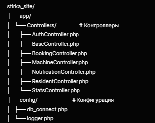
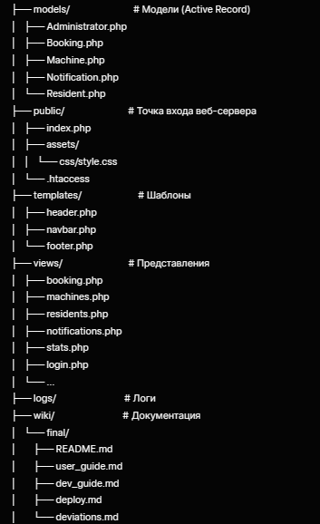
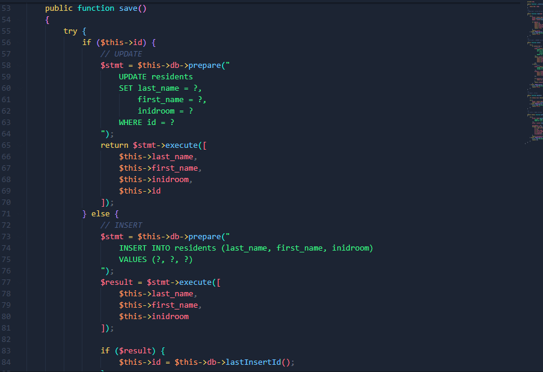
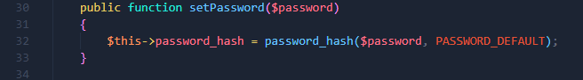
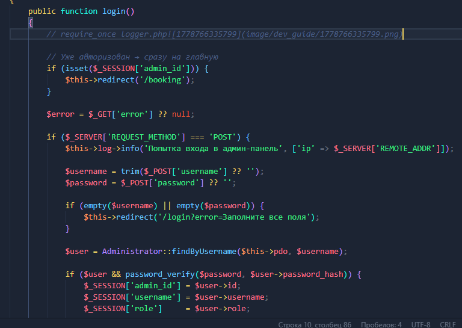
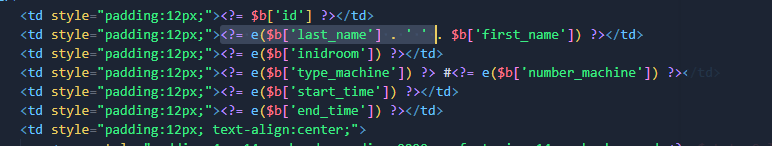
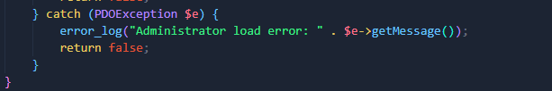
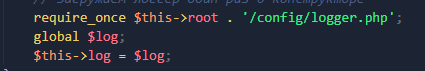
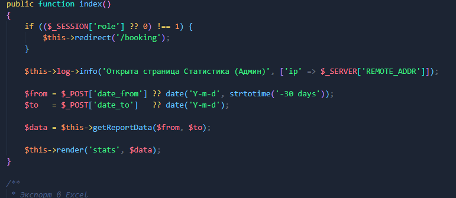

# Руководство разработчика (Developer Guide)

**Проект:** Сайт для администрирования Telegram-бота записи на стирку
**Версия:** 1.0
**Дата:** Май 2026

---

## 1. Структура проекта





---

## 2. Архитектура и паттерны (с примерами кода)

### 2.1. MVC (Model‑View‑Controller)

* **Модель** – Active Record (класс содержит поля таблицы и методы `load()`, `save()`, `delete()`).
* **Представление** – PHP‑файлы в `views/`, используют функцию `e()` для экранирования.
* **Контроллер** – наследник `BaseController`, получает `PDO` и логгер, вызывает модели, рендерит вид.

**Пример** (`controllers/BookingController.php`, строки 21–33):

**php**

```
            if (isset($_POST['mass_cancel'])) {
                $date = $_POST['cancel_date'];
                $type = $_POST['type_machine'];
                $result = Booking::massCancel($this->pdo, $date, $type);

                if ($result) {
                    $this->log->info('Массовая отмена', ['date' => $date, 'type' => $type, 'role' => $roleName]);
                    $this->redirect('/booking?success=Массовая отмена выполнена!');
                } else {
                    $this->log->error('Ошибка массовой отмены');
                    die('Ошибка при массовой отмене.');
                }
            }
```

Модель `Booking` статически обращается к БД.

### 2.2. Active Record (в моделях)

Каждая модель соответствует таблице.
**Пример** (`models/Booking.php`):

**php**

```
   public function save()
    {
        try {
            if ($this->id) {
                // UPDATE
                $stmt = $this->db->prepare("
                    UPDATE booking 
                    SET start_time = ?, 
                        end_time = ?, 
                        status = ?,
                        inidmachine = ?,
                        inidresidents = ?
                    WHERE id = ?
                ");
                return $stmt->execute([
                    $this->start_time,
                    $this->end_time,
                    $this->status,
                    $this->inidmachine,
                    $this->inidresidents,
                    $this->id
                ]);
            } else {
                // INSERT
                $stmt = $this->db->prepare("
                    INSERT INTO booking 
                    (start_time, end_time, status, inidmachine, inidresidents)
                    VALUES (?, ?, ?, ?, ?)
                ");
                $result = $stmt->execute([
                    $this->start_time,
                    $this->end_time,
                    $this->status ?? 'Ожидание',
                    $this->inidmachine,
                    $this->inidresidents
                ]);

                if ($result) {
                    $this->id = $this->db->lastInsertId();
                }
                return $result;
            }
        } catch (PDOException $e) {
            error_log("Booking save error: " . $e->getMessage());
            return false;
        }
    }

```

### 2.3. Фронт‑контроллер (маршрутизация через `.htaccess` + `public/index.php`)

Все запросы направляются на `index.php`, который разбирает `REQUEST_URI` и вызывает нужный контроллер.
**Пример упрощённой маршрутизации** (файл `public/index.php` – в данном проекте, возможно, используется прямая адресация `/booking.php`, но в структуре заявлен `index.php`).

> Если в проекте прямой вызов `booking.php` и т.д., то маршрутизация реализована на уровне файлов, без единой точки входа.

### 2.4. Шаблонизация без стороннего движка

Используется нативный PHP с буферизацией вывода через `require`.
**Пример** (`BaseController.php`, метод `render()`):

**php**

```
    protected function render($view, $data = [], $includeNavbar = true)
    {
        extract($data);
        require_once $this->root . '/templates/header.php';

        if ($includeNavbar && isset($_SESSION['admin_id'])) {
            require_once $this->root . '/templates/navbar.php';
        }

        require_once $this->root . '/views/' . $view . '.php';
        require_once $this->root . '/templates/footer.php';
    }
```

### 2.5. Dependency Injection (DI) через конструктор

Контроллеры получают `$pdo` и логгер через конструктор, что упрощает тестирование.
**Пример** (`BookingController.php`):

**php**

```
    public function __construct($pdo)
    {
        $this->pdo  = $pdo;
        $this->root = dirname(__DIR__, 2);

        // Загружаем логгер один раз в конструкторе
        require_once $this->root . '/config/logger.php';
        global $log;
        $this->log = $log;
    }
```

А `BaseController` инициализирует `$this->log`.

---

## 3. Технологический стек и обоснование выбора

| Технология                      | Назначение                                          | Почему выбрали                                                                                                              |
| ----------------------------------------- | ------------------------------------------------------------- | ---------------------------------------------------------------------------------------------------------------------------------------- |
| **PHP 8.0+**                        | Бэкенд‑язык                                        | Широкое хостинг‑окружение, низкий порог входа, хорошая интеграция с PostgreSQL |
| **SupaBaze(PostgreSQL)**            | Реляционная БД                                   | Надёжность, поддержка JSON, расширения (используется в Supabase)                               |
| **PDO**                             | Абстракция доступа к БД                   | Защита от SQL‑инъекций, поддержка нескольких СУБД                                                |
| **Plain PHP + MVC**                 | Архитектура                                        | Без фреймворка – лёгкость, полный контроль, образовательные цели                  |
| **Chart.js**                        | Построение графиков в статистике | Простота, интерактивность, малый вес                                                                      |
| **Composer**                        | Менеджер зависимостей                     | Управление библиотеками (PHPOffice, Monolog)                                                                       |
| **Monolog**                         | Логирование                                        | Гибкость, поддержка нескольких каналов (файл, БД)                                                |
| **PHPOffice**                       | Экспорт в Excel / Word                                | Стандарт де‑факто для генерации офисных документов на PHP                                 |
| **Docker** (опционально) | Изолированное окружение                 | Упрощает развёртывание, гарантирует одинаковые версии PHP/PostgreSQL                     |

**Особенности выбора:**

* **Без фреймворка** – чтобы продемонстрировать понимание MVC, сессий, маршрутизации «руками».
* **Active Record вместо ORM** – прозрачность запросов, учебный пример.
* **Supabase** в исходной задумке – но в коде используется прямое PDO с PostgreSQL, что универсально.

---

## 4. Возможные ошибки и проблемы (и способы устранения)

### 4.1. Ошибка подключения к БД

**text**

```
DB connection failed: could not find driver
```

**Причина:** Отсутствует расширение `pgsql` или `pdo_pgsql` в PHP.
**Решение:**

* Для Linux: `sudo apt install php-pgsql` и перезапустить веб‑сервер.
* Для Windows: раскомментировать `extension=pdo_pgsql` в `php.ini`.

### 4.2. Пустая страница / белый экран

**Причина:** Ошибка синтаксиса или непойманное исключение.
**Решение:**

* Включить `error_reporting(E_ALL); ini_set('display_errors', 1);` в начале `index.php`.
* Проверить логи (`logs/app.log`).

### 4.3. Сессии не сохраняются

**Причина:** Не вызван `session_start()` или директория для сессий недоступна для записи.
**Решение:**

* В `AuthController::login()` и `logout()` вызывается `session_start()` условно.
* Убедиться, что во всех контроллерах перед работой с `$_SESSION` есть `session_start()`.
* Рекомендуется вызывать `session_start()` в `header.php` или в точке входа.

### 4.4. Ошибка при экспорте в Excel/Word

**text**

```
Class 'ZipArchive' not found
```

**Причина:** Не установлено расширение PHP `zip`.
**Решение:** Установить `php-zip` и перезапустить веб‑сервер.

### 4.5. Не работает toggle (переключатель статуса машины)

**Причина:** Форма отправляется без JS, но может конфликтовать с другими полями.
**Решение:**
В `views/machines.php` используется:

**html**

```
<form method="POST" style="display:inline;">
    <input type="hidden" name="toggle_id" value="<?= $m->id ?>">
    <input type="checkbox" onchange="this.form.submit()">
</form>
```

Убедиться, что нет других `<form>` с таким же полем. В контроллере `MachineController` есть обработка `toggle_id`.

### 4.6. Ошибка `header already sent`

**Причина:** Вывод HTML или пробелы перед вызовом `header()` в контроллере.
**Решение:**

* Проверить, что в начале файлов (особенно `config/logger.php`, `db_connect.php`) нет пробелов или BOM.
* Использовать буферизацию вывода или перенести всю логику редиректа до рендеринга.

### 4.7. Массовая отмена не работает (статус не меняется)

**Причина:** Неправильный SQL‑запрос (сравнение дат без приведения).
**Решение:**
В `models/Booking.php` массовая отмена использует:

**sql**

```
booking.start_time::date = ?
```

Это специфика PostgreSQL. Для других СУБД заменить на `DATE(booking.start_time) = ?`.

### 4.8. Ошибка «Class 'Models\Booking' not found»

**Причина:** Не настроен автолоадинг Composer.
**Решение:** Выполнить `composer dump-autoload` и убедиться, что в `composer.json` прописано:

**json**

```
"autoload": {
    "psr-4": {
        "Models\\": "models/",
        "App\\Controllers\\": "controllers/"
    }
}
```

---

## 5. Работа с Docker (как изменить окружение, добавить сервис)

В проекте нет готового `docker-compose.yml`, но его можно добавить. Ниже пример для запуска приложения с PHP и PostgreSQL.

### 5.1. Создание `docker-compose.yml` в корне

**yaml**

```
version: '3.8'

services:
  web:
    build: .
    container_name: php-apache-app
    ports:
      - "8080:80" 
    volumes:
      - .:/var/www/html
    environment:
      - APACHE_RUN_USER=www-data
      - APACHE_RUN_GROUP=www-data
```

### 5.2. Сборка и запуск

**bash**

```
docker-compose up -d
```

### 5.3. Установка расширений PHP (pdo_pgsql)

Создайте `Dockerfile`:

**dockerfile**

```
FROM php:8.2-apache
RUN docker-php-ext-install pdo_pgsql
```

И измените `docker-compose.yml`:

**yaml**

```
web:
  build: .
  # ... остальное
```

### 5.4. Как добавить новый сервис (например, phpMyAdmin для PostgreSQL)

Добавить в `docker-compose.yml`:

**yaml**

```
adminer:
  image: adminer
  ports:
    - "8081:8080"
```

Теперь Adminer доступен на `http://localhost:8081`.

---

## 6. Инструменты и технологии обеспечения безопасности (с примерами)

### 6.1. Защита от SQL‑инъекций

Используются параметризованный запрос (**подготовленные запросы)** PDO.
**Пример** (`models/Resident.php`, метод `save()`):

**php**

```
$stmt = $this->db->prepare("INSERT INTO residents (last_name, first_name, inidroom) VALUES (?, ?, ?)");
$stmt->execute([$this->last_name, $this->first_name, $this->inidroom]);
```



### 6.2. Хэширование паролей

Используется `password_hash()` и `password_verify()`.
**Пример** (`models/Administrator.php`):

**php**

```
public function setPassword($password) {
    $this->password_hash = password_hash($password, PASSWORD_DEFAULT);
}
```

Проверка при входе (`AuthController.php`):

**php**

```
if ($user && password_verify($password, $user->password_hash)) { ... }
```





### 6.3. Защита от XSS

В шаблонах используется функция `e()` (аналог `htmlspecialchars`).
**Пример** (`views/booking.php`):

**php**

`<td><?= e($b['last_name'] . ' ' . $b['first_name']) ?>``</td>`



### 6.4. Управление сессиями

* Сессии стартуют только при необходимости.
* При выходе вызывается `session_destroy()` и удаляется cookie.
* **Пример** (`controllers/AuthController.php`, метод `logout()`):

**php**

```
$_SESSION = [];
if (isset($_COOKIE[session_name()])) {
    setcookie(session_name(), '', time() - 3600, '/');
}
session_destroy();
```

### 6.5. Логирование попыток входа и действий

Используется Monolog.
**Пример** (`AuthController.php`):

**php**

```
$this->log->info('Попытка входа', ['ip' => $_SERVER['REMOTE_ADDR']]);
$this->log->warning('Неудачная попытка входа', ['username' => $username]);
```





### 6.6. Контроль доступа по ролям

В каждом контроллере проверяется `$_SESSION['role']`.
**Пример** (`StatsController.php`):

**php**

```
if (($_SESSION['role'] ?? 0) !== 1) {
    $this->redirect('/booking');
}
```



### 6.7. Безопасность файловой системы

* Файлы логов находятся вне `public_html` (директория `logs/`).
* Конфигурации (`config/db_connect.php`) не доступны напрямую через веб.

---

> *Документ актуален для версии проекта из репозитория [GitHub](https://github.com/Ratarion/stirka_site.git). Все скриншоты кода должны быть сделаны непосредственно в IDE с указанием путей и номеров строк, как описано выше.*
