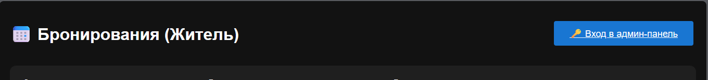
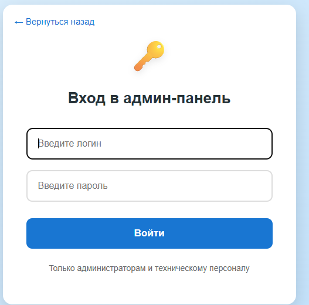
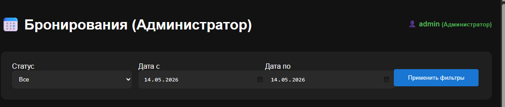
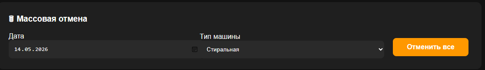
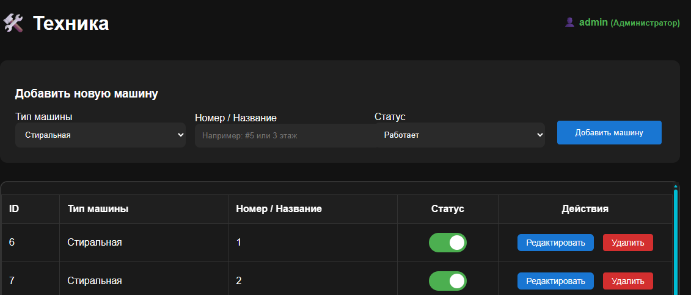
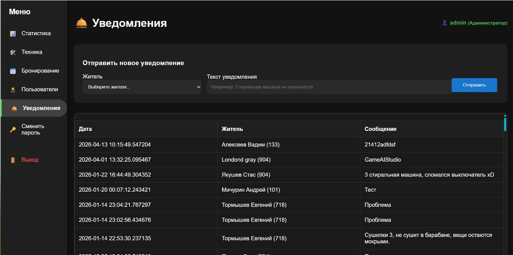
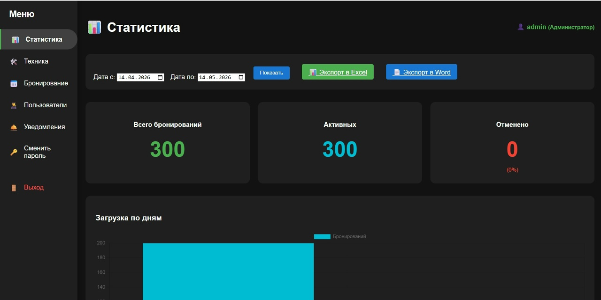

# Руководство пользователя

**Стирка** — Админ-панель системы записи на стирку и сушку

**Версия:** 1.0
**Дата:** Май 2026

---

## 1. Назначение системы и целевая аудитория

**Назначение** - Веб-приложение предназначено для администраторов и технического персонала общежитий КузГТУ. Оно позволяет:

- Мониторить и управлять бронированиями стирки/сушки
- Управлять списком жителей и оборудованием
- Получать и обрабатывать уведомления о поломках
- Анализировать статистику использования

**Целевая аудитория:**

- **Администраторы** (заведующие общежитиями, старшие администраторы)
- **Технические специалисты** (старосты этажей, техники)

---

## 2. Регистрация и вход в систему

Регистрация новых пользователей осуществляется только администратором (через базу данных или панель управления). Обычные пользователи не могут зарегистрироваться самостоятельно.

### Как войти в систему:

1. Перейдите по адресу сайта (например, `http://stirka.site.local` или `http://localhost`).
2. Нажмите кнопку **«Вход в админ-панель»**.

   
3. Введите логин и пароль.

   
4. Нажмите **«Войти»**.

**Пример учётных данных для теста:**

- Логин: `admin`
- Пароль: `admin123` 

**После успешного входа** вы попадёте на страницу бронирований.

---

## 3. Описание ролей

| Роль                             | ID роли | Возможности                                                                                                                                                                               |
| ------------------------------------ | ----------- | ---------------------------------------------------------------------------------------------------------------------------------------------------------------------------------------------------- |
| **Администратор** | 1           | Полный доступ: статистика, управление всеми разделами, массовая отмена, CRUD жителей и машин                                |
| **Техник**               | 2           | Просмотр бронирований, техники, жителей, отправка и просмотр уведомлений. Без массовой отмены и статистики |
| **Житель**               | —          | Только просмотр бронирований (без авторизации)                                                                                                               |

---

## 4. Основные сценарии работы

### 4.1. Просмотр и фильтрация бронирований (все роли)

1. Перейдите в раздел **«Бронирование»**.
2. Используйте фильтры по статусу и датам.
3. Примените фильтры.

### 4.2. Массовая отмена бронирований (только Администратор)

1. В разделе **Бронирование** найдите блок «Массовая отмена».
2. Выберите дату и тип машины.
3. Нажмите **«Отменить все»** и подтвердите действие.

### 4.3. Управление техникой

Перейдите в **«Техника»**.

- Добавление новой машины
- Редактирование
- Переключение статуса (работает / отключена)
- Удаление

### 4.4. Управление жителями

Раздел **«Пользователи» (Жители)**:

- Добавление новых жителей
- Редактирование данных
- Удаление

### 4.5. Работа с уведомлениями

Раздел **«Уведомления»**:

1. Выберите жителя.
2. Напишите текст проблемы (скрежет, протечка и т.д.).
3. Нажмите **«Отправить»**.

Все отправленные уведомления отображаются в таблице ниже.

### 4.6. Статистика (только Администратор)

Раздел **«Статистика»** содержит:

- Ключевые метрики
- Выбор даты
- Топ загруженных машин
- Возможность экспорта в Excel и Word

---

## 5. Часто задаваемые вопросы (FAQ)

**Вопрос:** Как добавить нового администратора?
**Ответ:** Через базу данных или обратитесь к главному администратору.

**Вопрос:** Забыл пароль, что делать?
**Ответ:** Реализована функция «Сменить пароль».

**Вопрос:** Почему не работает массовая отмена?
**Ответ:** Функция доступна только для роли **Администратор** (role = 1).

**Вопрос:** Как посмотреть уведомления от жителей?
**Ответ:** Все уведомления отображаются в разделе **«Уведомления»**.

**Вопрос:** Можно ли зайти без авторизации?
**Ответ:** Да — просмотр бронирований доступен всем, но управление возможно только после входа.

---

## 6. Полезные советы

- Все действия логируются.
- Интерфейс адаптирован под разные размеры экранов.
- При возникновении ошибок проверьте логи в папке `/logs`.

---

**Поддержка:**
По всем вопросам обращайтесь к разработчикам:
Якушев С.А., Сахаров В.В., Ильин П.Е. (группа ПИб-242)
